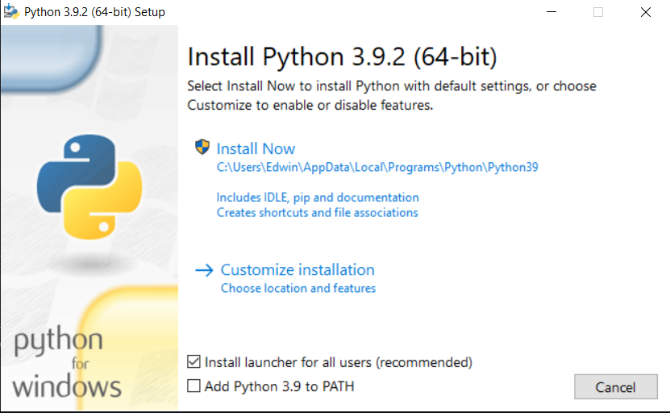
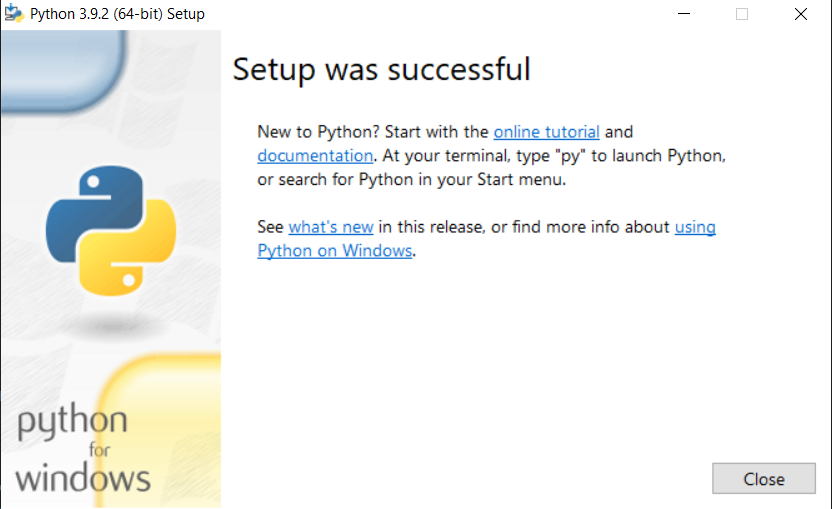
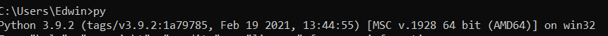
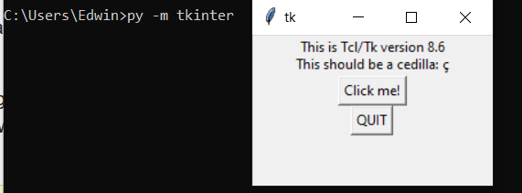
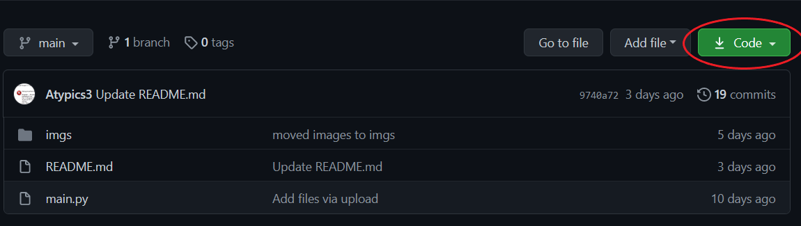
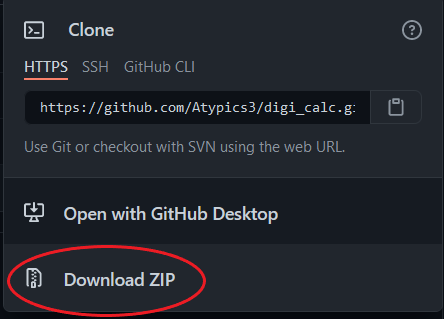

# digi_calc
A digital calculator in Python

## Table of contents
* [Description](#description)
* [Requirements](#requirements)
* Setup
  * [Installing Python](#installing_python)
  * [Using Source File](#source_file)
* [Sources](#sources)

## Description
This project consists of making a digital calculator with a GUI using Python and tkinter. This is mainly used as a follow-along tutorial for Chabot's Computer Hardware Club.

## Requirements
* A computer
* The latest version of [Python](https://www.python.org/downloads/) (latest version probably not needed, but just in case)
* The latest version of [tkinter](https://docs.python.org/3/library/tkinter.html) (should already be included with Python)

## Installing_Python
1. Click [here](https://www.python.org/downloads/) to download Python:


2. Once at the installation launcher, click ``"Install Now"`` and let the installation finish. The launcher should show this afterwards:


3. Once completed, go to your command prompt and type in ``py`` to make sure Python's installed:
 

4. To check if tkinter is installed, go to your command prompt and type in ``py -m tkinter``: 
 

5. To start, either use Python's built-in [IDLE](https://docs.python.org/3/library/idle.html) or download a [IDE](https://www.guru99.com/python-ide-code-editor.html) (Integrated Development Environment).

## Source_File
1. First, go to the green button called ```Code``` on the right-hand corner. 


2. Once there, click ```Download ZIP``` to download the entire project. It should look like this afterwards.


3. Using [WinRAR](https://www.rarlab.com/download.htm) or something similar, you can extract it into a IDE or Python's IDLE. Both will work just fine. If you're using Python's IDLE, you can just copy-paste the code into Notepad or IDLE itself.


## Sources
* https://pyshark.com/basic-gui-calculator-in-python/
